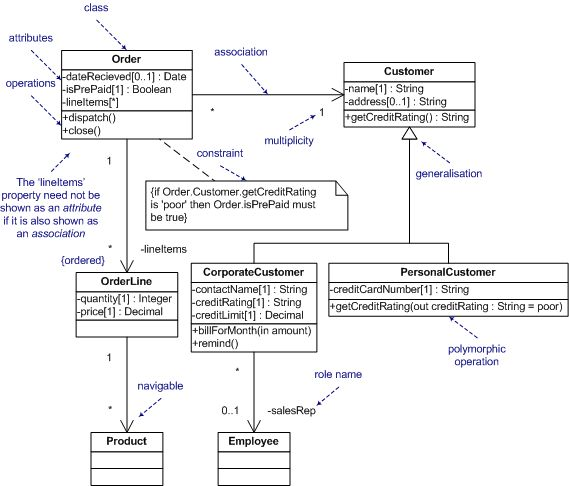

# Decoupling and Code
<h2 class="fragment">Decoupling Through the Ages</h2>
<h2 class="fragment">Decoupling: The Only Advancement in Progamming</h2>

Note:
Dear community,
as we all know in the beginning there was chaos and then came ...

---

## Procedural Programming

Note:
I hope I didn't hurt anyones religious feelings. I just love such jokes.

---

## Procedural Programming (2)

In the beginning there was chaos:
- ANYTHING was done to save memory |
- Modifiying code at runtime |
- No chance to reason about the code |

---

## Procedural Programming (3)

Then came procedures:
- they give structure to the program |
- they decouple from registers |
- they decouple from state in the calling procedure |
- they can be reused anywhere in the program |
- they can be reuse across projects |
- This is still used a lot. |

---

## Object Orientation

---

## Object Orientation (2)

- It grew strong together with GUIs |
- Classes encapsulate functionality and state |
- Thus they decouple from other classes |
- OOP works best for purely technical domains |
- Inheritence creates a lot of coupling |

---

## Clean Code

---

## Clean Code (2)

- Favour Composition over Inheritance |
- Separation of Concerns |
- Information Hiding Principle |
- Tell, don´t ask! (High cohesion) |
- Dependency injection |

---

## Clean Code (3)

SOLID principles:
- Single Responsibility Principle |
- Open Closed Principle |
- Liskov Substitution Principle |
- Interface Segregation Principle |
- Dependency Inversion Principle |

Note:
- Open Closed Principle: open for extension, closed for changes
- Interface Segregation Principle: many client-specific interfaces are better than one general-purpose interface
- Dependency Inversion Principle: one should depend upon abstractions, not concretions

---

## Messaging

---

## Messaging (2)

- Why don't we use HTTP internaly? |
- Asynchronism prevents time wise coupling: no timeout handling |
- Persistence prevents stability wise coupling: no exponential backoff that has to be randomised, no circuit breaker |
- Sender and receiver are decoupled with messaging. |

---

## Functional Programming

## Functional Programming (2)

- Functors (higher-order functions) allow composition of decoupled functions |
- Immutable data structures decouple concurrently running functions |
- Pure (side-effect free) functions are decoupled from any context including timing (lazy evaluation) |
- Especially good for multithreading |

---?image=assets/green-pasture.jpg

## What Can Happen If We Optimize for Decoupling?

- Decoupling as a natural thing to happen |
- Good match for business logic           |
- Easy to understand (low cognitive load) |
- Natural graphical representation        |
