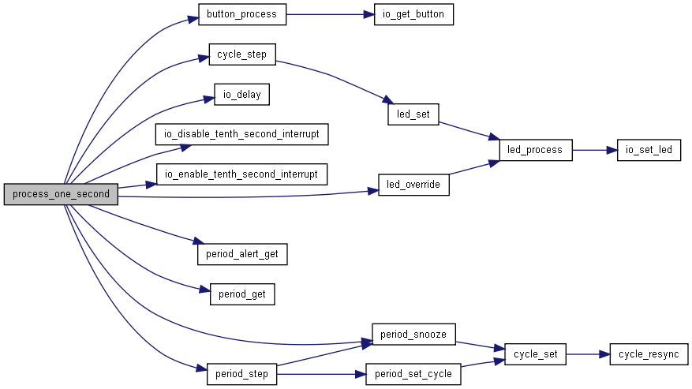

# Decoupling and Code
<h2 class="fragment">Or: Decoupling Through the Ages</h2>
<h2 class="fragment">Or: Decoupling. What Is It Good For?</h2>

---

## Procedural Programming

Note:
A call decouples from:

- Registers
- Variables in the calling procedure

A procedure can be called from and reused anywhere.

This is still used a lot esp. for utility functions.
